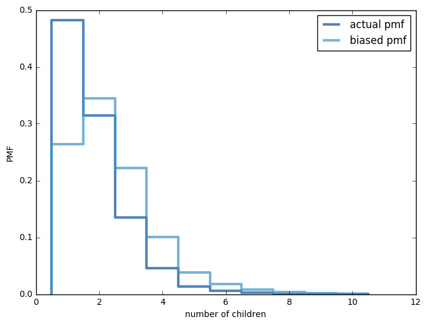

[Think Stats Chapter 3 Exercise 1](http://greenteapress.com/thinkstats2/html/thinkstats2004.html#toc31) (actual vs. biased)

>> Mean of actual pmf: 1.825644949715785  
Mean of biased pmf: 2.418477935452966  

