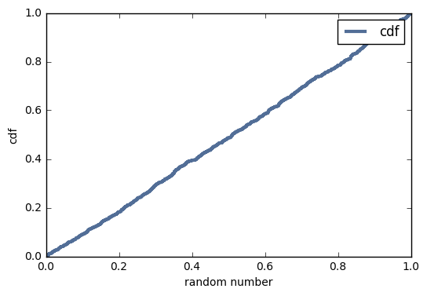
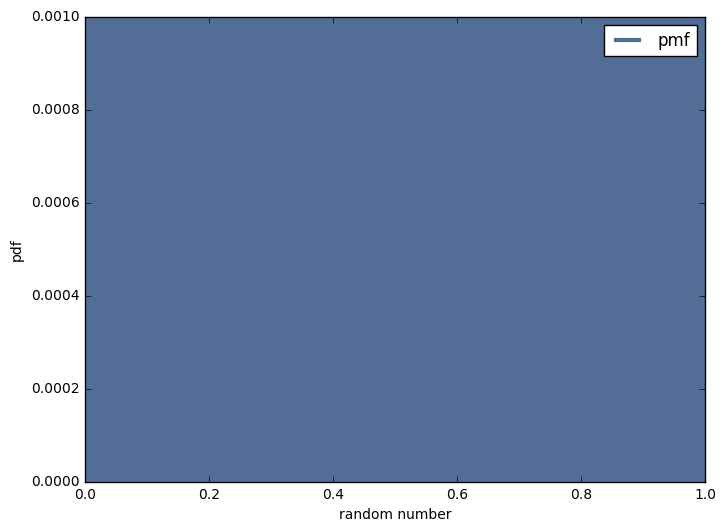

[Think Stats Chapter 4 Exercise 2](http://greenteapress.com/thinkstats2/html/thinkstats2005.html#toc41) (a random distribution)

>> The distribution is uniform, this is obvious from looking at the diagonal straight line of the cdf, and the uniform probability in the pmf.

Python code:
```Python
import random
import thinkstats2
import thinkplot

random_numbers = []
for i in range(1000):
    random_numbers.append(random.random())

cdf = thinkstats2.Cdf(random_numbers, label='cdf')
pmf = thinkstats2.Pmf(random_numbers, label='pmf')

thinkplot.Cdf(cdf)
thinkplot.Show(xlabel='random number', ylabel='cdf')

thinkplot.Pmf(pmf)
thinkplot.Show(xlabel='random number', ylabel='pdf')
```


